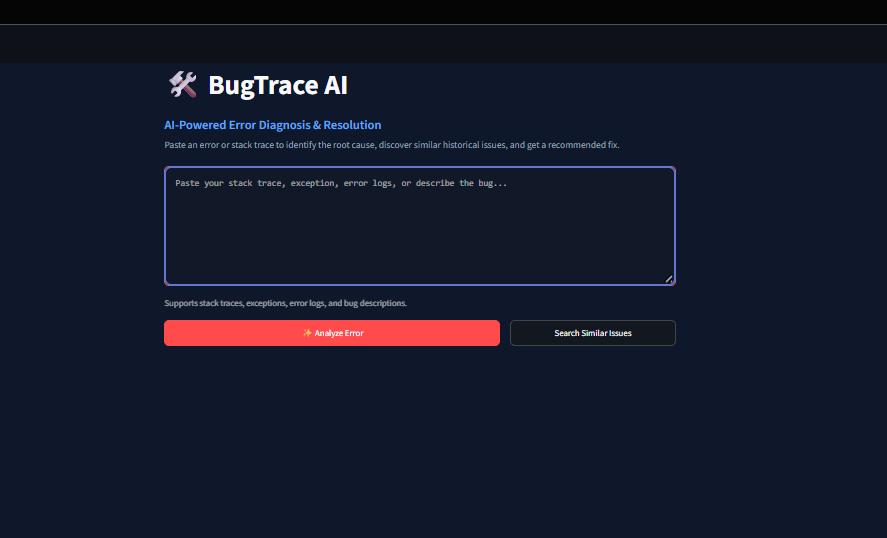
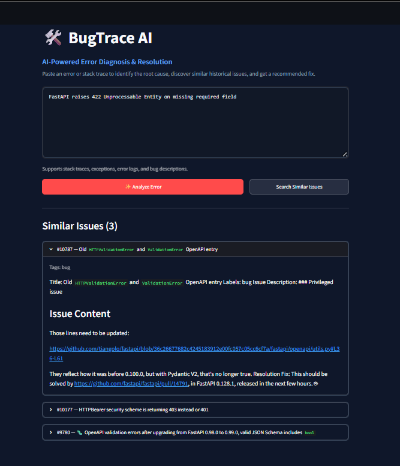
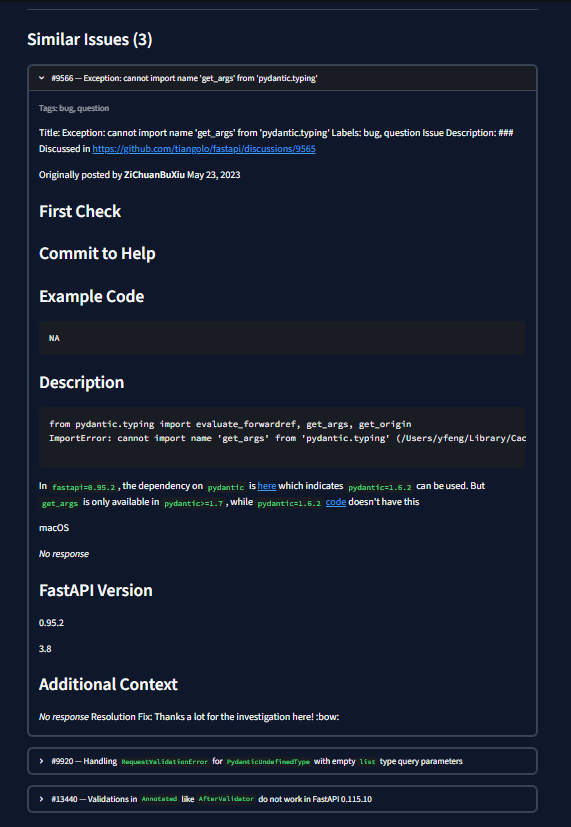
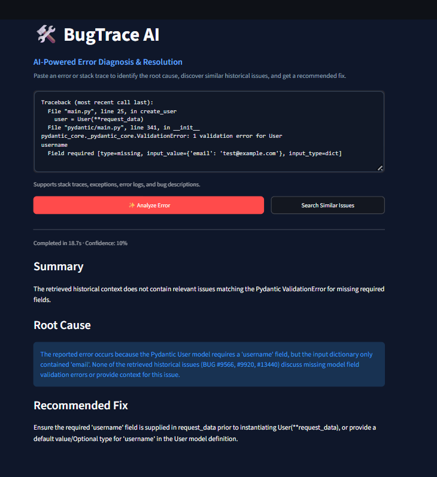
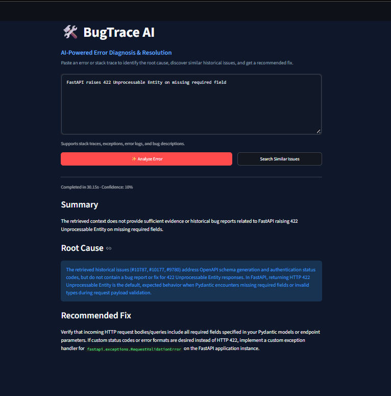

# BugTrace AI

AI-powered bug resolution assistant that uses historical GitHub issues and maintainer fixes to help diagnose errors, identify likely root causes, and suggest fixes.

The system combines **Hybrid RAG, PostgreSQL + pgvector, Reciprocal Rank Fusion (RRF), and Google Gemini structured outputs**.

## Screenshots

### Developer Console
<p align="center">
  
</p>

### Hybrid Issue Search
| Query & Initial Matches | Ranked Candidates |
| :---: | :---: |
|  |  |

### Structured Diagnosis
| Root Cause & Fix | Referenced Issue Citations |
| :---: | :---: |
|  |  |

## How It Works

A developer provides an error message, log, or stack trace. BugTrace AI:

1. Generates a 384-dimensional embedding using `all-MiniLM-L6-v2`.
2. Searches historical GitHub issues using two retrieval methods:
   - Vector similarity with `pgvector`
   - PostgreSQL full-text search with `ts_rank_cd`
3. Combines both rankings using **Reciprocal Rank Fusion (RRF)**.
4. Sends the top matching issues and their resolutions to Google Gemini.
5. Returns a structured diagnosis containing:
   - Summary
   - Root-cause analysis
   - Recommended fix
   - Referenced historical issues
   - Confidence score

If Gemini is unavailable, the system falls back to a deterministic offline diagnosis based on the top-ranked historical issue matches.

## Architecture

```text
                    GitHub Repository
                            │
                            ▼
                     GitHub REST API
                            │
                            ▼
                      ETL + Cleaning
                            │
                            ▼
              all-MiniLM-L6-v2 Embeddings
                            │
                            ▼
               PostgreSQL 16 + pgvector
               ┌────────────────────────┐
               │ HNSW Vector Index      │
               │ GIN Full-Text Index    │
               └───────────┬────────────┘
                           │
                    Hybrid Retrieval
                    ┌───────┴───────┐
                    │               │
              Vector Search    Full-Text Search
                    │               │
                    └───────┬───────┘
                            ▼
                       RRF Ranking
                            │
                          Top-K
                            │
                            ▼
                      Google Gemini
                    Structured Output
                            │
                            ▼
                         FastAPI
                            │
                            ▼
                        Streamlit
```

## Key Engineering Decisions

### Hybrid Retrieval

BugTrace AI does not rely on vector search alone. The retriever executes two searches inside PostgreSQL:

- **Semantic search** using cosine distance on 384-dimensional embeddings with an HNSW index.
- **Lexical search** using PostgreSQL full-text search with a GIN index and `ts_rank_cd`.

The results are merged using Reciprocal Rank Fusion:

```text
RRF Score =
1 / (60 + vector_rank) +
1 / (60 + text_rank)
```

This combines semantic similarity with exact technical matching for error names, status codes, and library-specific identifiers.

### PostgreSQL + pgvector

Issue metadata, searchable text, and embeddings are unified in PostgreSQL 16:

- **HNSW Index:** Approximate nearest-neighbor vector similarity search (`USING hnsw (embedding vector_cosine_ops)`)
- **GIN Index:** Full-text keyword retrieval (`USING GIN (text_searchable_index_col)`)
- **Connection Pooling:** psycopg_pool.ConnectionPool`

### Structured Gemini Output

Gemini responses are strictly constrained using a Pydantic `BugDiagnosisResponse` schema:

- `response_mime_type="application/json"`
- `response_schema=BugDiagnosisResponse`
- Grounding instruction restricting the diagnosis to retrieved historical context

The output is validated with Pydantic before being returned to the client.

### GitHub Issue ETL

The ingestion pipeline:

- Fetches closed GitHub issues and comments
- Filters pull requests and automated bot accounts/comments
- Extracts maintainer resolution comments
- Handles GitHub API rate limits and retries
- Cleans issue text while preserving code and stack traces (truncates oversized logs while retaining the top 30 and bottom 25 lines)
- Generates embeddings in batches of 32
- Uses idempotent database upserts (`ON CONFLICT (issue_number) DO UPDATE`)

## Tech Stack

| Area | Technologies |
|---|---|
| Backend | Python, FastAPI, Uvicorn |
| Retrieval | Sentence-Transformers, pgvector, PostgreSQL Full-Text Search |
| Embeddings | `all-MiniLM-L6-v2`, PyTorch |
| LLM | Google Gemini, `google-genai` |
| Validation | Pydantic |
| Database | PostgreSQL 16 |
| Frontend | Streamlit |
| Infrastructure | Docker, Docker Compose |
| Testing | Python `unittest` |

## Project Structure

```text
BugTrace AI/
├── api/                  # FastAPI application and routes
├── core/                 # Embeddings, retrieval, database and LLM logic
├── data/                 # Raw and processed issue data
├── etl/                  # GitHub extraction and ingestion pipeline
├── screenshots/          # Application screenshots
├── tests/                # Automated tests
├── ui/                   # Streamlit interface
├── .env.example          # Environment configuration template
├── docker-compose.yml    # PostgreSQL + pgvector
└── requirements.txt      # Python dependencies
```

## Setup

### 1. Clone the repository

```bash
git clone https://github.com/ashok-shetti/bugtrace-ai.git
cd bugtrace-ai
```

### 2. Create a virtual environment

```bash
python -m venv .venv
```

**Windows**
```bash
.venv\Scripts\activate
```

**Linux/macOS**
```bash
source .venv/bin/activate
```

### 3. Install dependencies

```bash
pip install -r requirements.txt
```

### 4. Configure environment variables

**Windows (cmd)**
```bash
copy .env.example .env
```

**Linux / macOS / PowerShell / Git Bash**
```bash
cp .env.example .env
```

Configure your PostgreSQL credentials and `GEMINI_API_KEY`. A `GITHUB_TOKEN` is recommended for larger ingestion jobs.

### 5. Start PostgreSQL + pgvector

```bash
docker compose up -d
```

### 6. Ingest GitHub issues

Example:

```bash
python etl/run_etl.py --repo tiangolo/fastapi --max-issues 200
```

Initialize the database schema and indexes:

```bash
python etl/ingest_pipeline.py --init-db
```

### 7. Start the API

```bash
uvicorn api.main:app --host 0.0.0.0 --port 8000 --reload
```

API documentation: `http://localhost:8000/docs`

### 8. Start the Streamlit interface

```bash
streamlit run ui/app.py
```

The UI runs at: `http://localhost:8501`

## API Endpoints

| Method | Endpoint | Purpose |
|---|---|---|
| `POST` | `/api/v1/diagnose` | Hybrid retrieval + Gemini diagnosis |
| `POST` | `/api/v1/search` | Search similar historical issues without LLM generation |
| `POST` | `/api/v1/ingest` | Trigger repository ingestion |
| `GET` | `/health` | Check database, model, and extension health |

## Testing

The project includes **35 tests** covering API, database, ETL, retrieval, and LLM-related components:

```bash
python -m unittest discover tests -v
```

## Current Limitations

- Repository information is collected during ETL but is not currently stored as a searchable field in the database schema, so multi-repository filtering is not implemented.
- The database schema is fixed to 384-dimensional embeddings.
- Embedding generation runs synchronously in the application process.
- The application is single-turn and does not maintain debugging conversation history.
- Large multi-million-issue deployments would require additional database and infrastructure tuning.
- Gemini depends on external API availability unless offline fallback is used.

## Future Improvements

- Repository-aware retrieval and multi-repository support
- Cross-encoder reranking
- Semantic caching
- Asynchronous background workers for large-scale ingestion